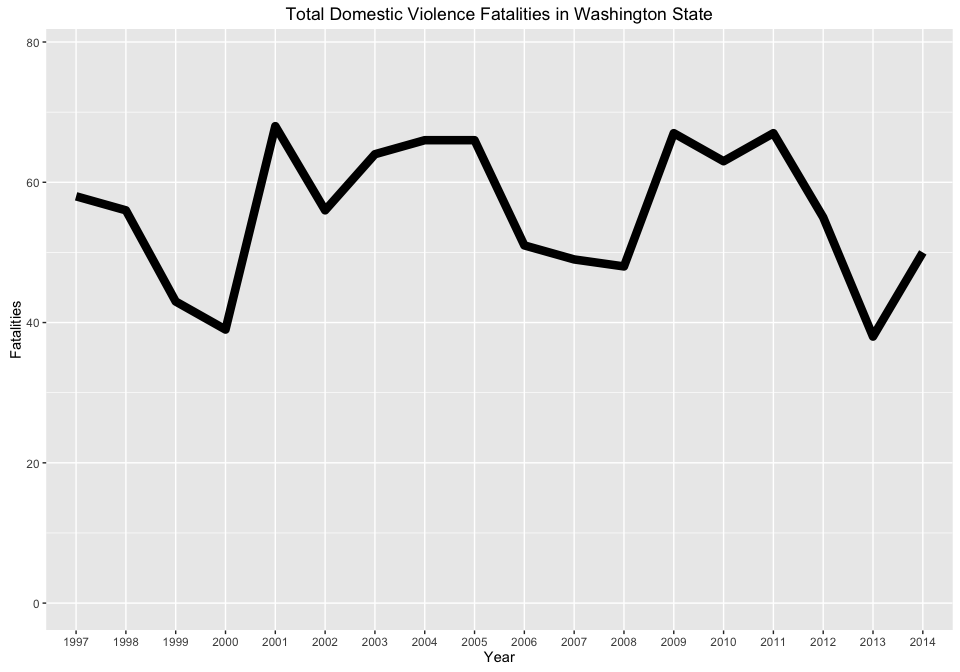
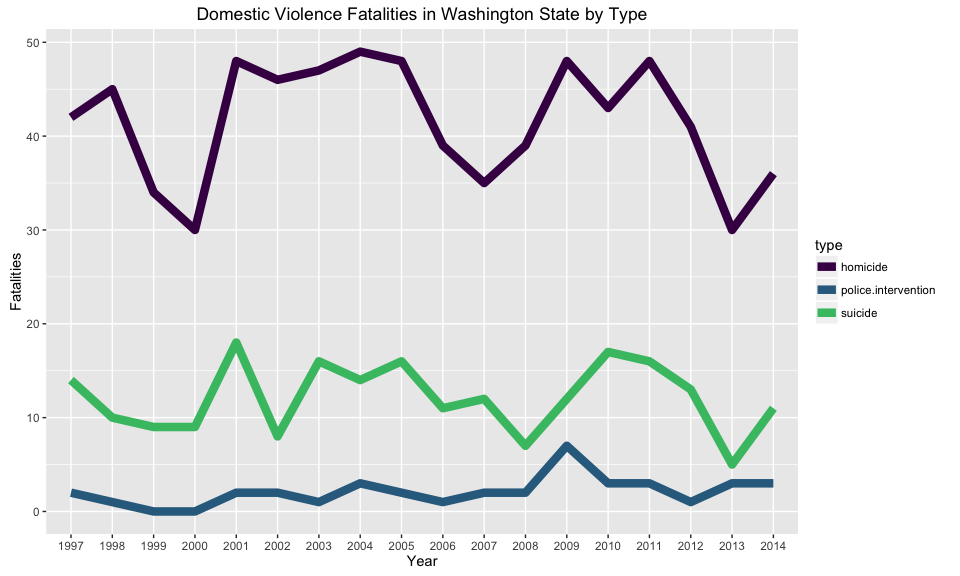

# Washington State Domestic Violence Fatalities

I am interested in understanding trends in domestic violence fatalities in
Washington state, specifically:

* Have rates of domestic violence homicides, suicides, and fatal police
  interventions changed over time?
* Which counties have the highest numbers of domestic violence homicides and
  suicides (particularly after normalizing for population)?

To address these questions I am using data from the Washington State Coalition
Against Domestic Violence's
[Domestic Violence Fatality Review](http://dvfatalityreview.org/) and population
data from the Office of Financial Management. The Domestic Violence Fatality
Review provides county-level data on domestic violence homicides, suicides, and
fatal police interventions from 1997 through 2015 (though I will only be using
data through 2014 as the second half of 2015 is not yet available). I used
[Tabula](http://tabula.technology/) to convert the
[data PDF](http://dvfatalityreview.org/2015/12/30/updated-through-6302015-washington-state-domestic-violence-fatalities-by-county/)
into a CSV. The resulting CSV is still quite messy and required some significant
data cleaning. The Office of Financial Management publishes yearly county-level
population estimates which are probably good enough for these purposes.

All of the cleaning and plotting of the data (with the exception of running the
data PDF through Tabula to get a CSV) was done in R. To reduce clutter and focus
on the visualizations I've hidden the code chunks, but they can be viewed in
[the .Rmd file](https://github.com/karawoo/INFX-598J-assignment-2/blob/master/code/dv_vis.Rmd).

## Distributions

What is the distribution of fatalities by county in a given year, normalized by
population?

\newpage

## Time series and temporal trends

What, if any, temporal trends are there in total fatalities and the three types
of fatalities?

\newpage

Can we see any trends in homicides by county?

Okay not that way...how about faceting?

\newpage

## Maps of fatalities by county

Predictably, this basically looks like a population map of Washington. So
instead let's look at the number of homicides per 10,000 people.

