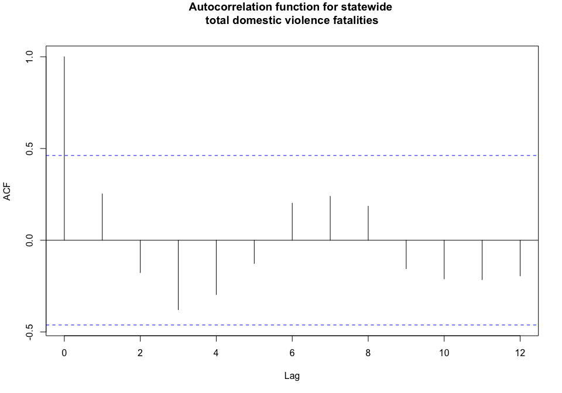
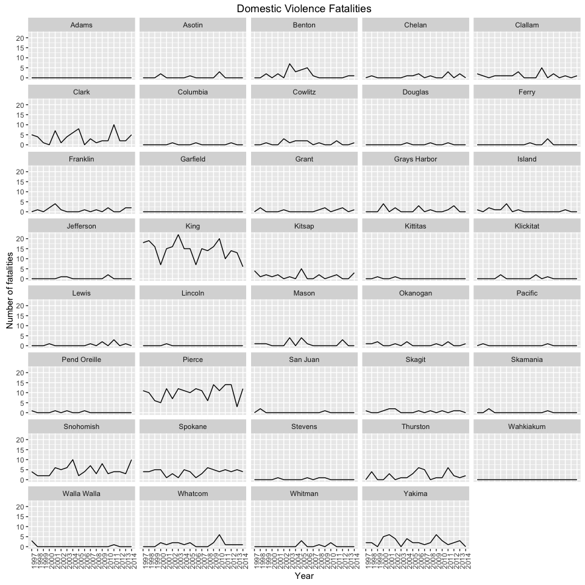

# Washington State Domestic Violence Fatalities


I am interested in understanding trends in domestic violence fatalities in
Washington state. Are there spatial and temporal trends in domestic violence
fatalities? To address this question, I have created visualizations to answer a
few narrower questions:

* Have rates of domestic violence homicides, suicides, and fatal police
  interventions changed over time?
* Which counties have the highest numbers of domestic violence homicides and
  suicides (particularly after normalizing for population)?


I am using data from the Washington State Coalition Against Domestic Violence's
[Domestic Violence Fatality Review](http://dvfatalityreview.org/) and
[population data](http://www.ofm.wa.gov/pop/april1/hseries/default.asp) from the
Office of Financial Management. The Domestic Violence Fatality Review provides
county-level data on domestic violence homicides, suicides, and fatal police
interventions from 1997 through 2015 (though I will only be using data through
2014 as the second half of 2015 is not yet available). Homicides, suicides, and
police intervention fatalities are defined thus:

> Homicide: Any homicide of one intimate partner by another, and other homicide
> deaths that happen in the context of intimate partner violence. These may
> include: domestic violence victims killed by abusive partners; children,
> friends and family members of domestic violence victims killed by abusers; law
> enforcement officers killed by abusers; abusers killed by domestic violence
> victims; abusers killed by friends, family, or bystanders intervening on
> behalf of a victim.
> 
> Suicide: Suicide deaths of domestic violence abusers, in the context of an
> intimate partner homicide or assault. These include domestic violence
> murder-suicide and abusers' suicide deaths following an attempted murder or
> homicide threats.
>
> Police intervention (new category): Abusers killed by law enforcement officers
> responding to domestic violence assault, homicide threats, or hostage
> situations. Most incidents are consistent with "suicide by cop," in which
> abusers threaten officers or victims with deadly violence to provoke a lethal
> response. In previous versions of this table, these deaths are included with
> abuser suicides.

The Domestic Violence Fatality Review also notes that these data are likely
underestimates, since they do not include cases that are unresolved or
unreported.

OFM's population estimates are based on the previous census, and while they are
only estimates they are likely sufficient for these purposes.

## Data cleaning and transformation

The Domestic Violence Fatality Review data is provided in PDF form. I used
[Tabula](http://tabula.technology/) to convert the
[PDF](http://dvfatalityreview.org/2015/12/30/updated-through-6302015-washington-state-domestic-violence-fatalities-by-county/)
into a CSV. The resulting CSV contained some mangled text and still required
significant data cleaning.

All of the cleaning and plotting of the data (with the exception of running the
data PDF through Tabula to get a CSV) is done in the code below. Both the
domestic violence fatality data and the population data were originally
presented in wide format, with years as columns. Both had multiple header rows
and extraneous columns.


```r
## First load the required packages
library("maps")
library("readxl")
library("tidyr")
library("dplyr")
library("ggplot2")
library("viridis")
library("wesanderson")

## Load data without the header row (years) for now -- we'll add that back in
## later
dv <- read.table(
  "../data/original/tabula-fatalities-by-county-through-6-30-2015.csv",
  sep = ",",
  skip = 1,
  header = FALSE,
  stringsAsFactors = FALSE
)

## Fix row of fatality types (homicide, suicide, police intervention)
dv[1, ] <- gsub("\n", "", dv[1, ])    # remove \n's
dv[1, grep("(?=.*h)(?=.*o)(?=.*m)(?=.*i)(?=.*c)(?=.*d)(?=.*e)",
            dv[1, ], perl = TRUE)] <- "homicide"
dv[1, grep("(?=.*s)(?=.*u)(?=.*i)(?=.*c)(?=.*d)(?=.*e)",
            dv[1, ], perl = TRUE)] <- "suicide"
dv[1, grep("(?=.*p)(?=.*o)(?=.*l)(?=.*i)(?=.*c)(?=.*e)",
            dv[1, ], perl = TRUE)] <- "police.intervention"

## Get year values from first row of CSV. 
years <- scan(
  "../data/original/tabula-fatalities-by-county-through-6-30-2015.csv",
  nlines = 1, sep = ",", what = character()
)

## This creates a vector of years and empty strings. In the data, year is shown
## as a merged cell that arches over columns for suicide, homicide, and police
## intervention columns. In the CSV there is no concept of merged cells, so each
## year appears once and the other two columns have no year associated with
## them. We'll fix this in the next step.

## Fill in empty strings. There should be 3 entries for each year. The following
## creates 6 for 2015; the last three are actually columns of totals that are
## going to be removed anyway.
for (i in seq_along(years)) {
  if (i == 1) {
    years[i] <- years[i]
  }
  else if (years[i] == "") {
    years[i] <- years[i - 1]
  }
}

## Paste together year and fatality type into one column header -- these will be
## separated later after reshaping the data into long format
newnames <- paste(years, dv[1, ], sep = "_")
newnames[1] <- "county"

## Use year and fatality type as column names
names(dv) <- newnames

## Now get rid of first row of data that contains fatality types, the last row
## of data that contains state-wide totals, and last three columns which are
## totals for the time series
dv <- dv[-c(1, nrow(dv)), -c(ncol(dv), ncol(dv) - 1, ncol(dv) - 2)]
```


```r
## Now reshape the data into long format and do some final tidying
dv_long <- dv %>%
  ## Gather into long format
  gather(key = yeartype, value = fatalities, -county) %>%
  ## Separate yeartype column into year and fatality type
  separate(yeartype, c("year", "type"), sep = "_") %>%
  ## Based on the original PDF it looks like NAs should be true zeroes
  mutate(fatalities = ifelse(fatalities == "", "0", fatalities)) %>%
  ## Convert fatalities to numeric
  mutate(fatalities = as.numeric(fatalities))
```


```r
## Download population estimate data from OFM
## download.file(
##   url = "http://www.ofm.wa.gov/pop/april1/hseries/ofm_april1_postcensal_estimates_pop_1960-present.xlsx",
##   destfile = "../data/original/postcensal_pop_estimates.xlsx"
## )

## Load population estimate data
pop <- read_excel(
  "../data/original/postcensal_pop_estimates.xlsx",
  sheet = 2, skip = 3
)

## Make syntactically valid column names
names(pop) <- make.names(names(pop), unique = TRUE)

## Remove empty and unnecessary columns and rows
pop <- pop %>%
  select(-starts_with("NA")) %>%
  filter(Filter == 1 & !County %in% c("State", ".")) %>%
  select(-Line, -Filter, -Jurisdiction)
    
## Remove periods from column names
names(pop) <- gsub("\\.", "", names(pop))

## Convert data to long format
pop_long <- pop %>%
  gather(key = year, value = pop, -County) %>%
  rename(county = County) %>%
  ## Remove postcensal estimates in years where there is an actual census
  filter(!year %in% c("X1960PostcensalEstimateofTotalPopulation",
                      "X1970PostcensalEstimateofTotalPopulation",
                      "X1980PostcensalEstimateofTotalPopulation",
                      "X1990PostcensalEstimateofTotalPopulation",
                      "X2000PostcensalEstimateofTotalPopulation",
                      "X2010PostcensalEstimateofTotalPopulation")) %>%
  mutate(year = substr(year, 2, 5)) %>%
  ## Remove data from before 1997 (the start of DV data)
  filter(year >= 1997) %>%
  ## Make population and year numeric
  mutate(pop = as.numeric(pop),
         year = as.numeric(year))
```

After the data cleaning, I merged the domestic violence fatality data and the
population data into one data set.


```r
dat <- merge(dv_long, pop_long, by = c("county", "year"))
```


I've chosen not to include the code for the following visualizations, as it is
not part of the assignment as stated. However if you're interested, you can view
it
[here](https://github.com/karawoo/INFX-598J-assignment-2/blob/master/code/dv_vis.Rmd).

## Distributions

My first step is to examine the distribution of fatalities in a given year.
Since fatalities occur in whole numbers, a bin width of 1 seems a reasonable
place to start. This histogram will show the number of counties that have 1, 2,
3, etc. fatalities in each year.


However, not all counties have the same number of people, so it is probably not
appropriate to compare them in this way. Here I am summing all types of
fatalities (homicides, suicides, and police interventions) and dividing them by
county population / 10,000 to get the number of fatalities per 10,000
population. 


The data appears to be heavily right-skewed and may conform to a Poisson
distribution, which is common for count data.

## Time series and temporal trends

Next I am interested in seeing what, if any, temporal trends are there in total
fatalities and the three types of fatalities?


It appears that there is a bit of year-to-year variation, but no clear trend.
Perhaps the picture looks different if we break the data out by fatality type.


Again there do not seem to be any obvious trends. I could maybe be convinced
that the number of police intervention fatalities is increasing, but it would
definitely need some follow-up. However, this is useful as it confirms that the
majority of domestic violence related fatalities are homicides.

If I were planning more confirmatory statistics with this data I'd probably want
to know about the degree of temporal autocorrelation, so I'm including a plot of
the temporal autocorrelation function for total statewide domestic violence
fatalities.



It doesn't look like there's significant temporal autocorrelation.

Next I want to break down the temporal trends by county.


Okay not that way...how about faceting?


Faceting is a little better. I'll also look at total fatalities (not just
homicides).



These look fairly similar. Benton County had a bit of a bump in the mid-2000s
and a few counties have had pretty variable fatality rates, but the majority
don't seem to show a dramatic pattern.

I'll also look at population-normalized rates over time:


This is not incredibly helpful. There are some weird spikes, but they're mostly
in counties with small populations where a single fatality has a
disproportionate impact.

## Maps of fatalities by county

For the following visualizations, county boundary data comes from `ggplot2`'s
`map_data()` function.


Predictably, this basically looks like a population map of Washington. So
instead let's look at the number of homicides per 10,000 people.


